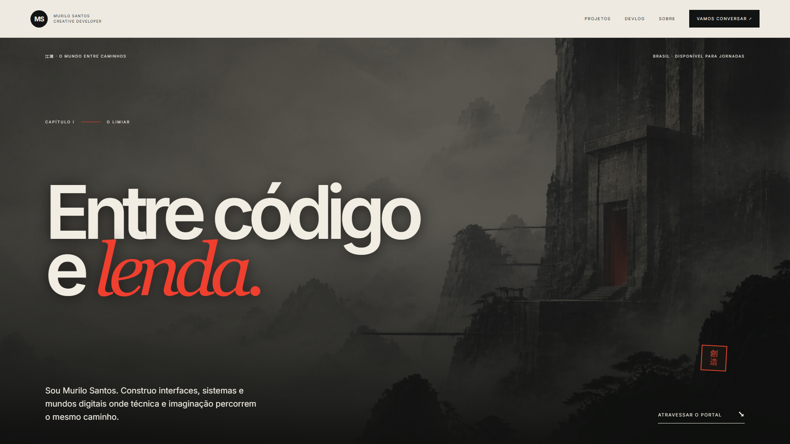

# Portfólio Wuxia — Murilo Santos

Portfólio pessoal para apresentar meu trabalho em desenvolvimento front-end, produtos autorais e experiências interativas. A direção visual inspirada em wuxia organiza projetos, devlog e contato em uma experiência com identidade própria.

[**Visitar o portfólio**](https://portfoli-novo.vercel.app)

## Destaques

- Catálogo de projetos com contexto, tecnologias e links verificáveis
- Estudos de interface e landing pages responsivas
- Devlog com decisões e evolução do trabalho
- Layout adaptado para dispositivos móveis

## Captura



## Tecnologias

`Next.js` · `React` · `TypeScript` · `Tailwind CSS`

## Executar localmente

```bash
npm install
npm run dev
```

Acesse `http://localhost:3000`.

## Status

Em evolução contínua. O site publicado é a referência da versão em produção.